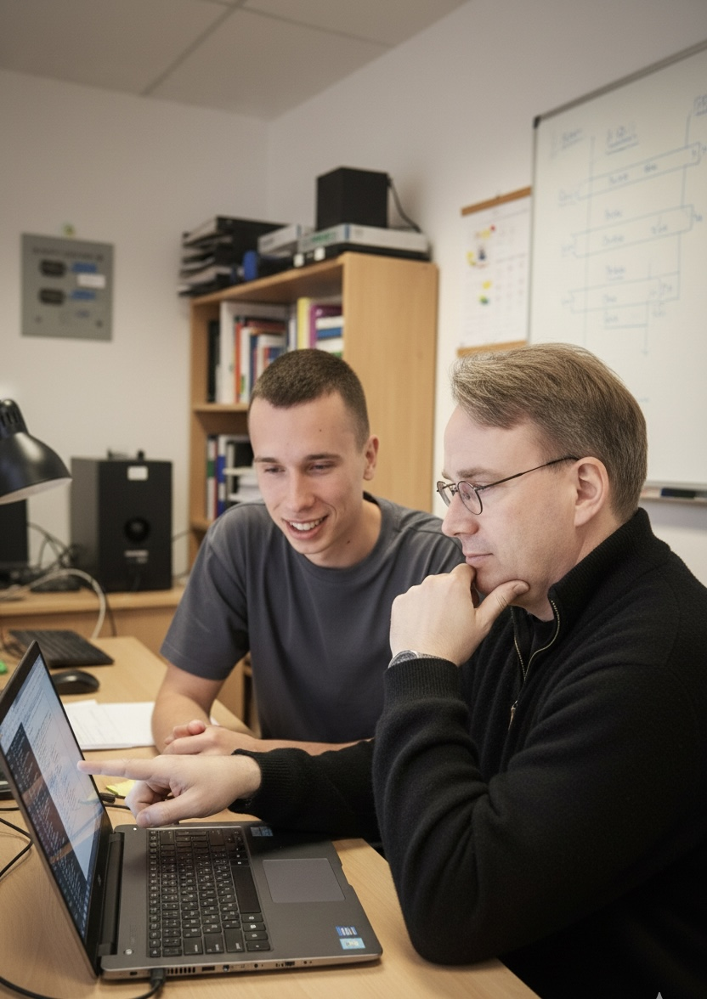

# Hi, I am Semion Dubrovschii

I write software that people seem to use.

---

---

## About Me

- Backend engineer with a rich experience
- Advocate of pragmatic engineering over hype
- Focused on performance, correctness, and clean design
- Maintainer and reviewer at heart

I care about code quality, simplicity, and things that actually work in production.

---

## Areas of Interest

- Operating systems
- Kernel development
- Version control systems
- Low-level performance optimization
- Open-source governance
- New tech

---

## Programming Languages

### I Know
1. Java
2. C

### Currently Learning
- Git internals (yes, that counts)
- Markdown 

### Interested In
- Better static analysis tooling
- Safer systems programming approaches

---

## Contact

- Email: dubrovschiisemion@gmail.com
- Phone: let's use email, thanks.

